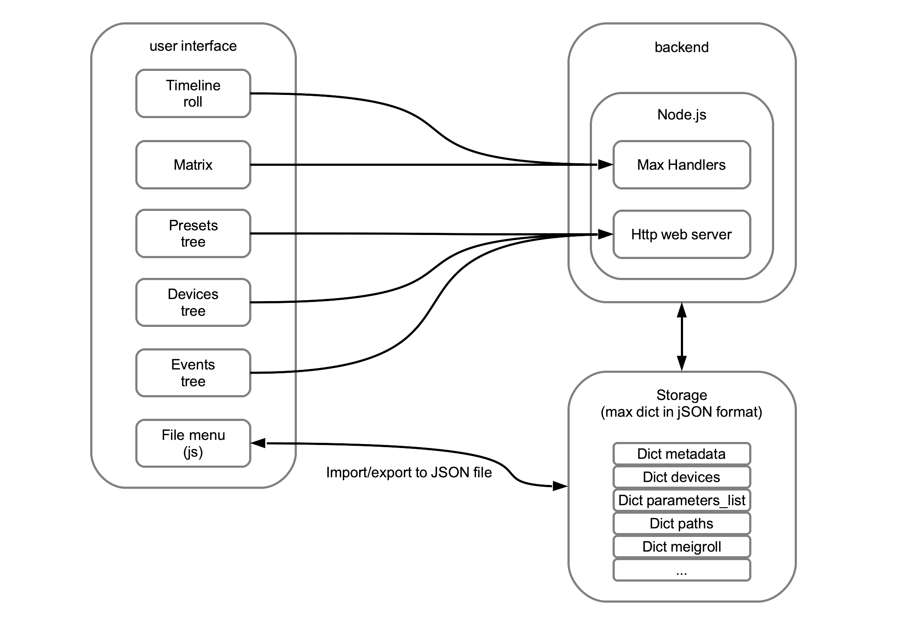
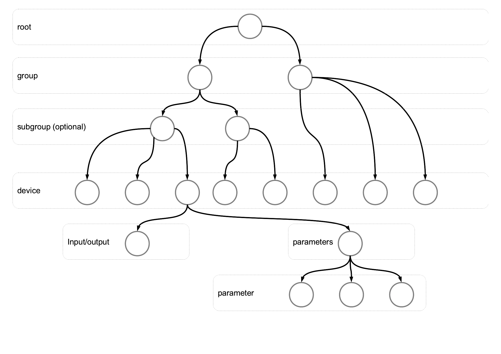
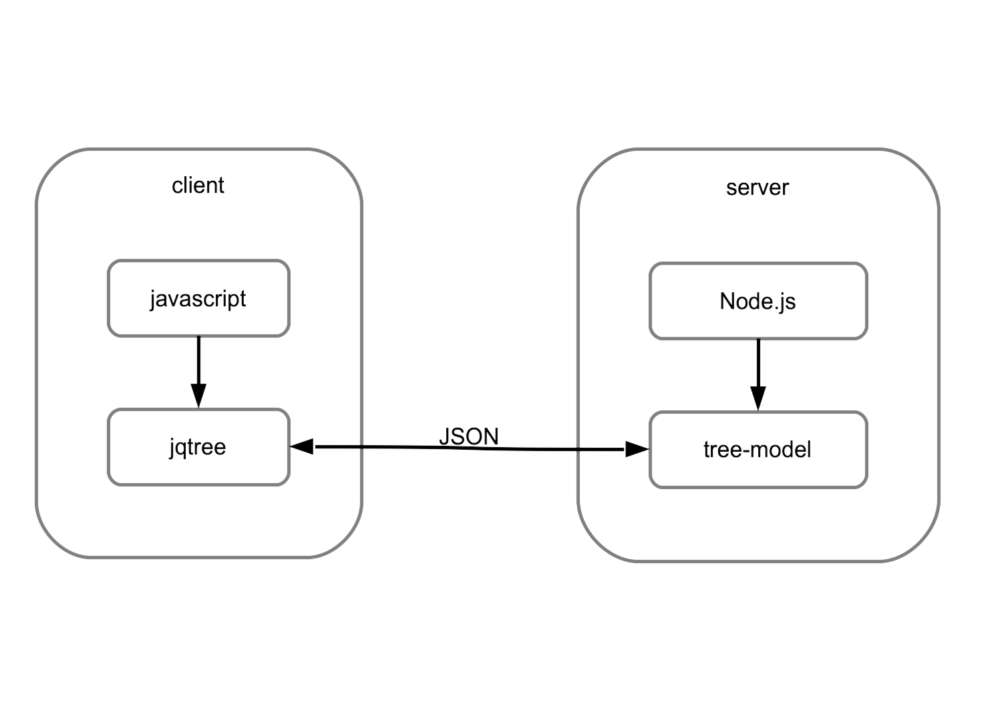
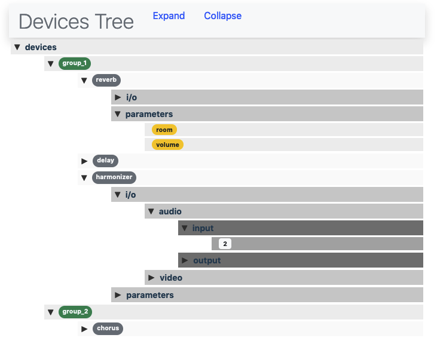
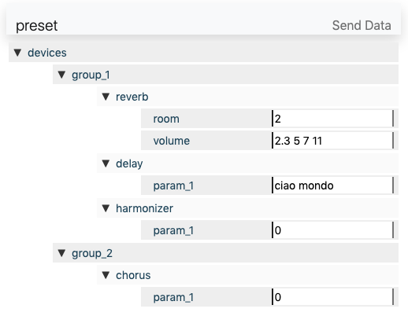
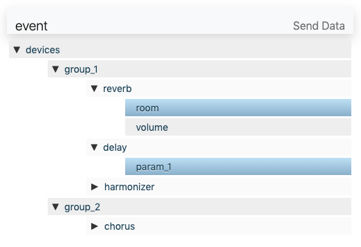

# MEIG SYSTEM

## Introduzione

_mEiG system_ nasce per fornire agli artisti multimediali uno strumento per sviluppare, gestire e fissare un progetto che coinvolga strumenti interattivi audio, video e di physical computing. Si tratta di un sistema di controllo integrato che permette di rappresentare diversi _device_ e di definirne il comportamento nel tempo grazie a specifiche configurazioni statiche (_preset_) e dinamiche (_automazioni_).  
Per rendere più agevole le azioni dell'utente, l'attuale implementazione di _mEiG_, che coinvolge diverse tecnologie, è ospite di una patch di **Max 8** (_Cycling74_), da cui è possibile installare tutti i componenti alla pressione di un pulsante e compiere le operazioni più comuni sui files di progetto.

## Tecnologia

Il sistema _mEiG_ nasce esplicitamente come progetto di sviluppo dell'originale MEEG, dal quale mutua alcuni principi e funzionalità, ma da cui si discosta per altri aspetti, talora cruciali. Il sistema MEEG è basato su un'architettura web client-server, dove il backend è costruito su un server PHP e un database sql (MySql), mentre il frontend è basato su un'interfaccia html con il protocollo http come base di comunicazione.  
Il sistema mEiG usa invece un ecosistema tecnologico che garantisce portabilità e leggerezza. E' mantenuta l'architettura client-server, ma sussiste un'accentramento delle componenti. Il software Max, che dalla versione 8 integra un server nodeJS, si pone al centro dell'ecosistema. Il server nodeJS (che sostituisce il PHP) è implementato all'interno dell'oggetto **node.script** e si installa con un click direttamente dall'interno di Max. Il client, costituito da una serie di componenti javascript/html, viene caricato _pezzo per pezzo_ in oggetti **jweb**, all'interno dello stesso Max. Infine il database sql viene sostituito da una serie di dizionari (Max dictionaries) che, sostanzialmente, sono costituiti da strutture dati in formato JSON.

### SQL/noSQL

La scelta di non utilizzare un _db engine_ come sql nasce dall'esigenza di snellire la portata dell'applicazione e di velocizzare le operazioni di interrogazione e di scambio dei dati. La struttura relazionale è sembrata eccessiva rispetto alla mole di dati richiesti da un singolo progetto. Come si sa, sql tende ad essere molto efficiente su una grande mole di dati, ma perde la sua efficacia in presenza di un rapporto basso fra numero di righe e numero di colonne. Per arrivare alla soluzione adottata sono stati fatti alcuni passaggi concettuali (e pratici):

-   Inizialmente è stato risolto il problema della portabilità utilizzando un'istanza di sqlite integrata nel server, ma questo non ha risolto il problema della scalabilità e dell'efficienza delle query. Anzi, l'impossibilità di scrivere delle _stored procedures_ all'interno del _db engine_ ha aumentato considerevolmente le quantità di _join_ e rallentato di conseguenza la velocità di interrogazione.
-   A questo punto ci si è rivolti verso una struttura più adatta al tipo di dati presenti: il database a grafo. Una struttura dati che rappresenti l'informazione con nodi e archi è sembrata garantire maggiore velocità di interrogazione in grafi non troppo complessi come quelli di mEiG. Le _join_ qui vengono sostituite da meccanismi di attraversamento (_traversing_), evitando lentissimi prodotti cartesiani fra le righe delle teballe relazionali. Purtroppo però questo è andato a discapito della portabilità, visto che la maggior parte dei database a grafo (OrientDB, Neo4J, etc...) non sono integrati, ma sussitono come _engine_ standalone, quindi vanno installati e configurati autonomamente.
-   Il grafo comunque è sembrata la struttura dati più vicina alla rappresentazione naturale dei dati di mEiG. In particolare l'_albero_ (che di fatto è una forma di grafo orientato) sembrava sufficiente a rappresentare i dati e le loro relazioni. L'ultimo passo quindi è stato quello di implementare degli alberi tramite il formato JSON. Grazie alla possibilità di usare **array associativi** come tipo di dato primitivo, intrinseca nel JSON, rappresentare un albero tramite JSON è stato abbastanza immediato. Il JSON inoltre, oltre a garantire arbitrari livelli di innesto, è il formato di interscambio nel web per eccellenza, e in prospettiva, sembra la struttura più adeguata per rendere il mEiG una piattaforma distribuita.

### html/javascript

Max integra al suo interno un motore javascript basato sulla versione ES5 (ormai vecchia) e impedisce l'importazione di packages esterni. Per questo motivo, piuttosto che utilizzare il javascript integrato, si è preferito scrivere dei moduli esterni in html/js/css che vengono importati in Max tramite l'oggetto **jweb**. Questo scelta ha garantito la possibilità di importare alcuni packages esterni sia per la gestione grafica delle interfacce (jquery e bootstrap), sia per la manipolazione delle strutture dati (jqtree).
Inoltre l'html con javascript permette di implementare un'architettura non sono scalabile, ma traslabile su altre piattaforme che non siano Max. Allo stato attuale del progetto in effetti il solo oggetto che implementa la timeline e le entità da temporizzare (**roll** e **slot** rispettivamente) non sono agnostici rispetto alla piattaforma. Tutte le strutture dati e le altre entità sono basate di linguaggi e tecnologie standard del web.

## Infrastruttura

L'app ha una struttura ibrida: una parte delle componenti comunicano tramite il protocollo HTTP, trasmettendo dati in formato JSON; un'altra parte accede direttamente al backend tramite dei manipolatori _ad hoc_ (Max handlers). Al centro dell'infrastruttura si trova un server implementato in node.js, che raccoglie le chiamate sia dai client http che dalle componenti ad accesso diretto. I dati vengono mantenuti localmente in oggetti Max di tipo **dict**. Si tratta _de facto_ di strutture dati in formato JSON che possono essere aggregate al momento dell'esportazione su file, anch'essi in formato JSON.

In figura si può osservare la struttura generale dell'applicazione.



Per quanto riguarda la persistenza dei dati, è sembrato opportuno utilizzare una struttura dati ad albero, la cui rappresentazione più naturale fosse lo stesso JSON.

I dati vengono rappresentati in strutture ad albero con radice. Ogni nodo deriva da uno e un solo genitore, mentre può avere nessuno, uno o più figli. La figura seguente mostra la struttura (parziale) dell'albero dei _devices_.



Ogni nodo è identificato da un _id_ univoco nel sistema, quindi può essere modificato senza dover essere duplicato e nuovamente referenziato. L'albero viene rappresentato all'interno dei _dict_ di Max in formato JSON: Ogni nodo ha almeno un _id_ (l'unico elemento non modificabile), una _label_ e una chiave _type_. Se non si tratta di una _foglia_ ha la chiave **children**, che contiene un array dei nodi figli:

```json
{
    "label": "main",
    "id": "1234abcd5678efgh",
    "type": "devices",
    "children": [
        {
            "label": "group_1",
            "id":"id": "0000abcd5678asdf",
            "type": "group",
            "children": [
                {"...":"..."}
            ]
        },
        {
            "label": "group_2",
            "id": "2222sdas12312yrue333",
            "type": "group",
            "children": [
                {"...":"..."}
            ]
        }
    ]
}
```

La struttura ricorsiva di ogni nodo permette di rendere alcuni _types_ innestabili a livelli diversi. L'entità di tipo _group_ ad esempio, può avere come _children_ altre entità sinonime:

```json
{
    "label": "group_1",
    "id":"id": "0000abcd5678asdf",
    "type": "group",
    "children": [
        {
            "label": "subgroup_1",
            "id":"id": "0000abcd5678asdf",
            "type": "group",
            "children": [
                {"...":"..."}
            ]
        }
    ]
}
```

Tali strutture dati vengono gestite sia lato client che lato server con _packages_ che permettono di modellizzare le strutture dati ad albero; come si vede in figura il pacchetto javascript **jqtree** si occupa di gestire l'albero lato client, mentre il pachetto **tree-model** gestisce gli alberi lato server.



## Graphical User Interfaces

### Devices, Preset, Event

Allo stato attuale del progetto, l'entità che rappresenta l'albero dei _Devices_ ha una rappresentazione grafica realizzata in html/css/javascript e contenuta all'interno della _patch_ di Max nell'oggetto **jweb**. A partire da questa entità vengono creati altri due alberi, _Presets_ ed _Events_, con strutture grafiche analoghe. L'albero dei _Devices_ viene servito all'utente all'atto dell'apertura di un file esistente o della creazione di un file nuovo e permette di inserire nel sistema nuovi dispositivi. L'entità centrale di questa struttura è il **device** che contiene gli input/output e i parametri, e che può essere a sua volta contenuto in gruppi o sottogruppi. Per aggiungere, rimuovere o rinominare un'entità dall'albero è sufficiente usare i menu contestuali attivabili col destro del mouse.

Dall'albero dei _Devices_ derivano le altre due strutture, _Preset_ ed _Event_, che permettono, rispettivamente, di impostare i valori di tutti i parametri in un preset e di scegliere quali parametri utilizzare all'interno di un event. Graficamente il _Preset Tree_ è composto da una vista ad albero con tutti i parametri provvisti di un _form_ in cui inserire il valore (_Number_, _String_ o _Array_). L'_Event Tree_ invece è un mero elenco di tutti i parametri, con la possiblità di selezionare quelli interessati.





## TODO

-   Implementazione di un motore di play (unità di misura del tempo, scalatura della velocità di riproduzione, etc...)
-   Formalizzazione di un sistema di messaggistica OSC
-   Messaggistica MIDI
-   Sistema distribuito (centralizzato o decentralizzato) -> Sistema di condivisione e sincronizzazione dei files in tempo reale
-   Connessione con interfacce _reali_ audio, video, MIDI e physical computing (Arduino, Raspberry, ESP32, Bèla)
